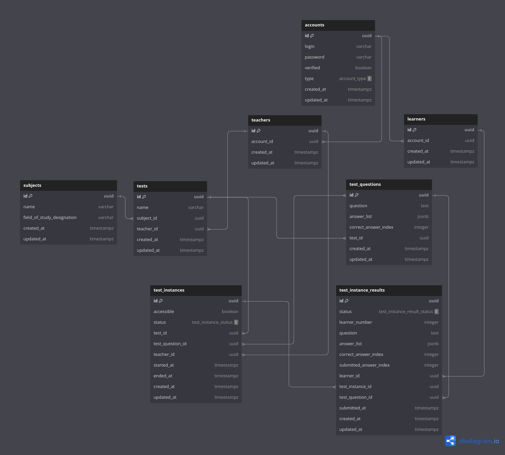

# Blueprint

Written down ideas for `TestSystem` project

## Ideas

1. Assumptions
    * Teachers can easily create and import tests from spreadsheet file
    * Teachers can easily export tests results as pdf or spreadsheet file
    * Teachers can manually start and stop test
    * Teachers must manually assign *Learner number* to each learner and store learners association list on their own
    * Learners can easily log in (OAuth) and take any available test
    * Learners can join with *Learner number* and answer questions when given test is started
    * Learners and teacher have access to their tests results
    * Each learner gets the *Learner number* assigned by teacher before test starts and enters it to be able to start
      test attempt
    * Whole application should not persist GDPR vulnerable data
    * Test accessible: True, False (learner can join with *Learner number*)
    * Test status: Created, Started (learner can answer a question), Ended

2. System flow
    * Registration for teachers via email/password or OAuth
    * Each teacher account is verified on database side
    * Public registration for learners via email/password or OAuth
    * Login (logout) ability for teachers
    * Login (logout) ability for learners
    * Test creation tool for teachers (importable questions)
    * Test management tool for teachers (list, edit, remove, export questions)
    * Test instance management tool for teachers (start, stop, available, unavailable, timer, fixed questions
      list/random given amount of questions, export results)
    * Available test list for learners
    * Test results history for teacher
    * Test viewer tool for learners (join with *Learner number*, fetch questions one by one, answer questions to the
      end, see the results)

## Backend

1. Endpoints (REST API)

   | METHOD | ENDPOINT                                           | SHORT DESCRIPTION                             | AUTHORISATION NEEDED |
   |--------|----------------------------------------------------|-----------------------------------------------|----------------------|
   | POST   | /auth/login                                        | Login to an account with given credentials    | NO                   |
   | POST   | /auth/register                                     | Register a new account                        | NO                   |
   | POST   | /auth/logout                                       | Logout from an account                        | ACCOUNT              |
   | POST   | /auth/change-password                              | Change an account password                    | ACCOUNT              |
   | GET    | /teachers/@me                                      | Get teacher information for logged account    | TEACHER              |
   | GET    | /subjects                                          | Get list of subjects                          | TEACHER              |
   | POST   | /subjects                                          | Create a new subject                          | TEACHER              |
   | GET    | /subjects/:subject_id                              | Get a subject                                 | TEACHER              |
   | PUT    | /subjects/:subject_id                              | Update a subject                              | TEACHER              |
   | DELETE | /subjects/:subject_id                              | Delete a subject                              | TEACHER              |
   | GET    | /tests                                             | Get list of tests                             | TEACHER              |
   | POST   | /tests                                             | Create a new test                             | TEACHER              |
   | GET    | /tests/:test_id                                    | Get a test                                    | TEACHER              |
   | PUT    | /tests/:test_id                                    | Update a test                                 | TEACHER              |
   | DELETE | /tests/:test_id                                    | Delete a test (cascade)                       | TEACHER              |
   | GET    | /tests/:test_id/test-questions                     | Get list of test questions                    | TEACHER              |
   | POST   | /tests/:test_id/test-questions                     | Create a new test question                    | TEACHER              |
   | GET    | /tests/:test_id/test-questions/:test_question_id   | Get a test question                           | TEACHER              |
   | PUT    | /tests/:test_id/test-questions/:test_question_id   | Update a test question                        | TEACHER              |
   | DELETE | /tests/:test_id/test-questions/:test_question_id   | Delete a test question (cascade)              | TEACHER              |
   | GET    | /tests/:test_id/instances                          | Get list of test instances                    | TEACHER              |
   | POST   | /tests/:test_id/instances                          | Create a new test instance                    | TEACHER              |
   | GET    | /tests/:test_id/instances/:test_instance_id        | Get a test instance                           | TEACHER              |
   | PUT    | /tests/:test_id/instances/:test_instance_id        | Update a test instance                        | TEACHER              |
   | DELETE | /tests/:test_id/instances/:test_instance_id        | Delete a test instance (cascade)              | TEACHER              |
   | GET    | /learners/@me                                      | Get a learner information for logged account  | LEARNER              |
   | GET    | /learner/test-instances                            | Get list of learner accessible test instances | LEARNER              |
   | GET    | /learner/test-instances/:test_instance_id          | Get list a learner accessible test instance   | LEARNER              |
   | POST   | /learner/test-instances/:test_instance_id/join     | Join to a test instance as learner            | LEARNER              |
   | GET    | /learner/test-instances/:test_instance_id/question | Get a test instance current question          | LEARNER              |
   | POST   | /learner/test-instances/:test_instance_id/answer   | Answer to test instance current question      | LEARNER              |

2. Domain
    * Account
        * Id
        * Verified
        * AccountType (Teacher, Learner)
        * Teacher/Learner

    * Teacher
        * Id
        * Account

    * Learner
        * Id
        * Account

    * Subject
        * Id
        * Name
        * FieldOfStudyDesignation
        * Test[]

    * Test
        * Id
        * Name
        * Subject
        * TestQuestion[]
        * TestInstance[]

    * TestQuestion
        * Id
        * Question
        * Answer[]
        * CorrectAnswerIndex
        * Test

    * TestInstance
        * Id
        * Test
        * TestQuestion[]
        * Accessible
        * TestStatus (Created, Started, Ended)
        * StartedAt
        * EndedAt
        * Teacher
        * TestInstanceResult[]

    * TestInstanceResult
        * Id
        * TestInstance
        * Learner (Unique with LearnerNumber)
        * LearnerNumber (Unique with Learner)
        * TestQuestion
        * Answer[]
        * CorrectAnswerIndex
        * SubmittedAnswerIndex
        * Status (Created, CorrectlyAnswered, IncorrectlyAnswered)
        * SubmittedAt

3. Database
    * DBML file - [click here](database/schema.dbml)
    * SQL schema - [click here](database/schema.sql) (generated by https://dbdiagram.io)
    * Schema view image (generated by https://dbdiagram.io)
      

## Tasks

[Click here](TASKS.md) to check planned tasks
